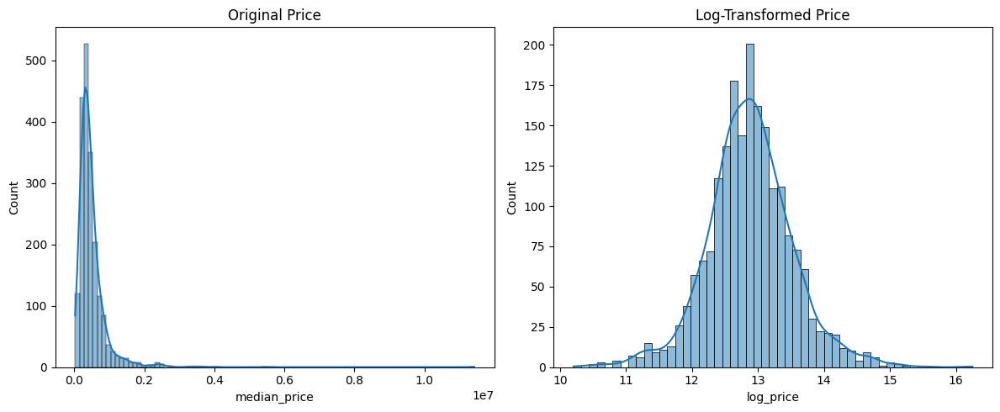
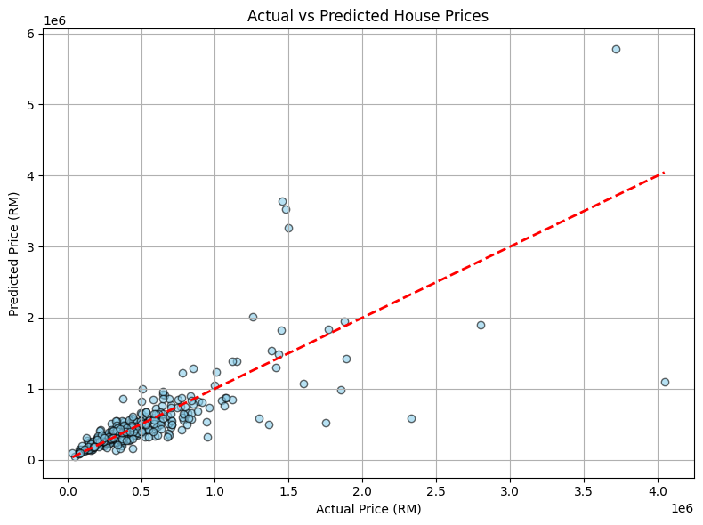
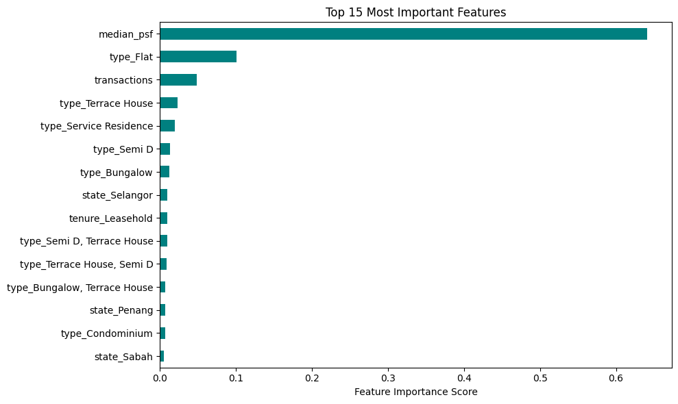

# 🏠 Kuala Lumpur Property Price Predictor

A machine learning project to predict residential property prices in Kuala Lumpur and across Malaysia using real estate transaction data.

---

## 🎯 Project Objective

Help real estate agents, investors, and homebuyers estimate property prices more accurately using a predictive model built from historical data.

This model can be used to:
- ✅ Suggest competitive listing prices
- ✅ Identify undervalued properties
- ✅ Understand which features most influence price

---

## 📂 Dataset

- 📄 **Source**: Kaggle
- 🏘️ **Size**: 2,000 property transactions
- 🗂️ **Features**:
  - `Township`, `Area`, `State`
  - `Type` (e.g., Terrace, Cluster)
  - `Tenure` (Freehold, Leasehold)
  - `Median_Price` (Target)
  - `Median_PSF` (Price per square foot)
  - `Transactions` (No. of sales in that area)

---

## 🔍 Exploratory Data Analysis (EDA)

- 🧾 Price data was highly **right-skewed** — we applied **log transformation** to normalize it.
- 📈 `Size`, `Median_PSF`, and `Transactions` showed strong correlations with price.
- 📦 Box plots and one-hot encoding were used to analyze price variations across:
  - Location (`State`, `Area`)
  - Property type (`Type`)
  - Tenure (`Tenure`)

---

## 🛠️ Feature Engineering

- ✅ One-hot encoding for categorical features (`Type`, `State`, `Tenure`)
- ✅ Grouping rare `Area` entries into `"Other"`
- ✅ Created a log-transformed target column `log_price`

---

## 🤖 Model: Random Forest Regressor

- Trained using `RandomForestRegressor` with 100 trees
- No feature scaling required
- Trained on log-transformed price, predictions converted back using `np.expm1()`

### 🔍 Evaluation Metrics

| Metric | Value |
|--------|-------|
| **R² Score** | `0.7716` |
| **RMSE (log scale)** | `0.3114` |

🎯 This means our model explains ~77% of the variance in prices and makes predictions within ~30% error range on average.

---

## 📈 Key Visualizations

### 1. Log-Transformed Price Distribution



---

### 2. Actual vs Predicted Price (in RM)



---

### 3. Feature Importance

Top 15 most important features contributing to price predictions:



---

## ✅ Conclusion

This project successfully built a working property price prediction model using real-world Malaysian housing data. It can be expanded further by:

- Adding geolocation data
- Including economic indicators (e.g., interest rates)
- Scraping live data from iProperty/PropertyGuru

---

## 💼 Tools & Libraries

- Python (Jupyter Notebook)
- `pandas`, `numpy`
- `seaborn`, `matplotlib`
- `scikit-learn`

---

## 📁 Project Structure

## 📁 Project Structure

```
kl-property-price-predictor/
├── data/
│   └── malaysia_house_price_data_2025.csv       # Dataset file
├── notebooks/                                   # Jupyter notebooks (empty or placeholder)
├── property_price_prediction.ipynb              # Main ML notebook
├── README.md                                    # Project description and instructions
└── requirements.txt                             # Python dependencies
```

---

## 🧠 Author

This project was built as part of a machine learning portfolio.